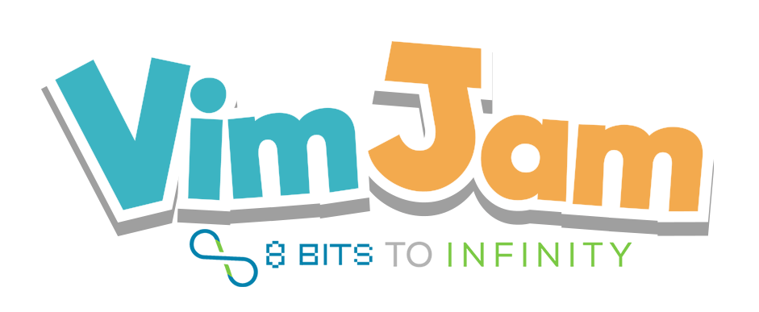
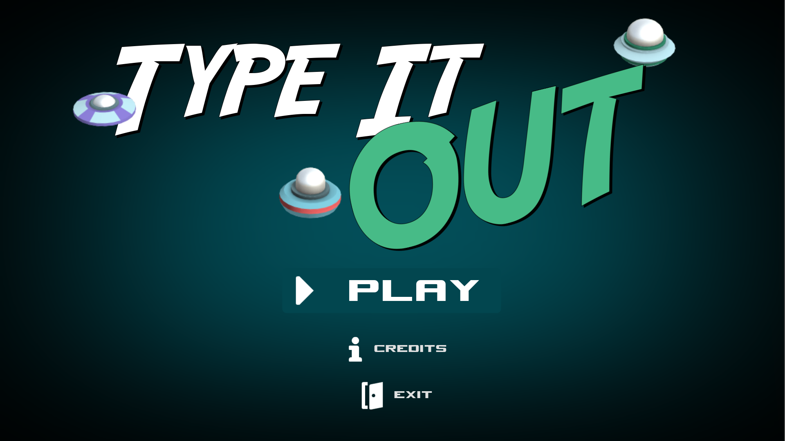
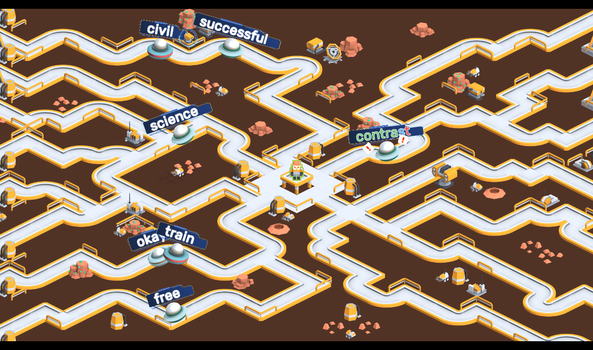
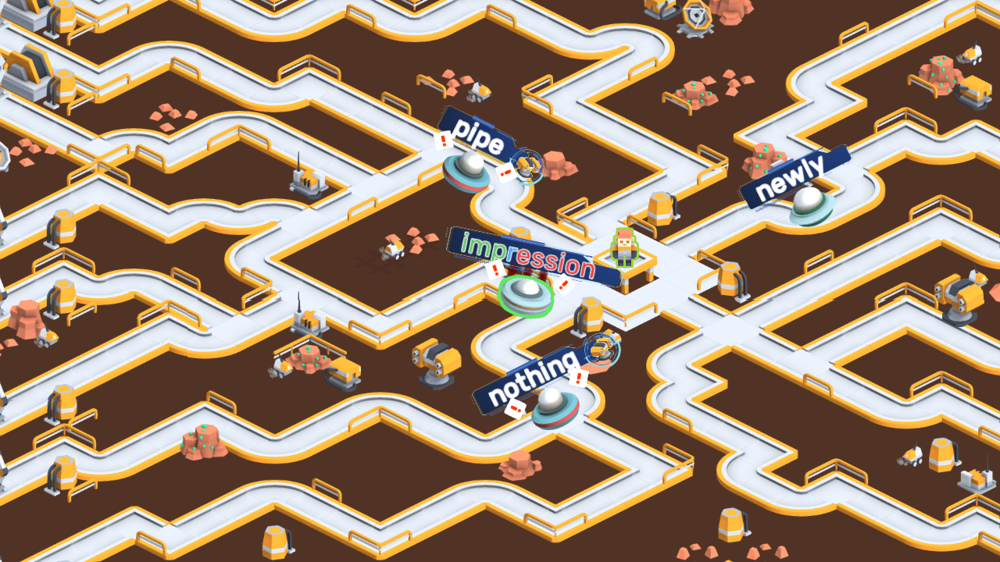
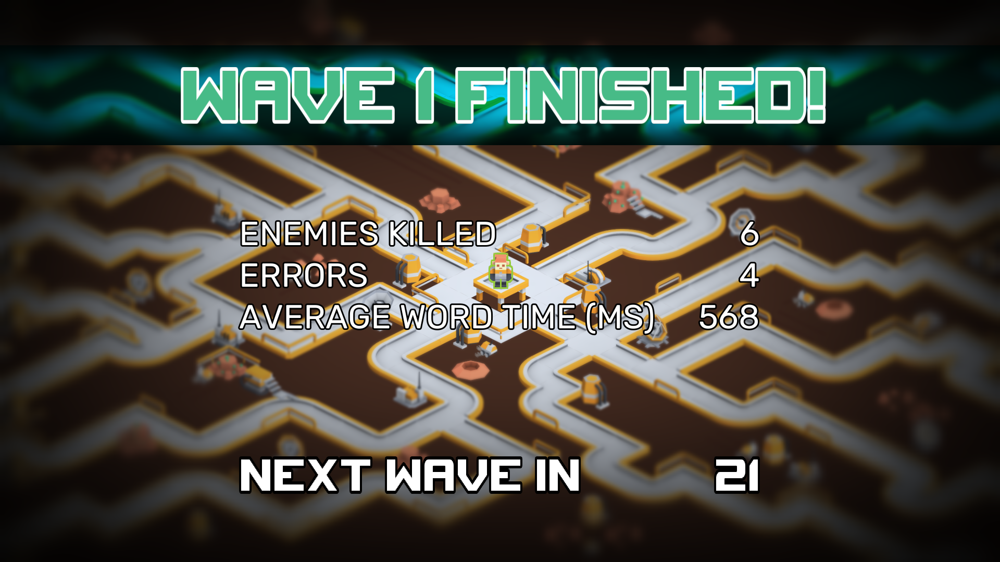
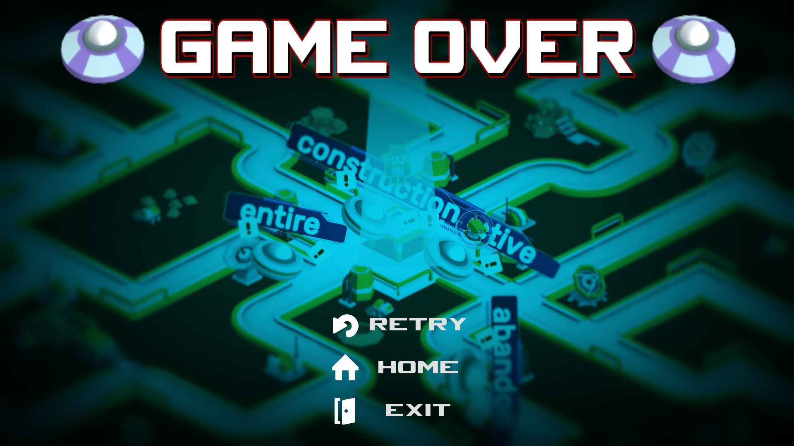

# Type It Out

A typing/tower defense game where you collect your defense by typing away your enemies

## About me & the game

- [Twitter](https://twitter.com/VicMeunier)
- [GitHub](https://github.com/MrEliptik)
- [GitHub game's repo](https://github.com/MrEliptik/TypeItOut)
- [Itch.io page](https://mreliptik.itch.io/type-it-out)
- [Sketchfab](https://sketchfab.com/victor.meunierpk)
- [Website](https://www.victormeunier.com/)
- [Blog](https://blog.victormeunier.com/)

## How to play: 

Type the words displayed on top of the enemies. Their label will color to indicate where you are: green is typed, blue is the current letter, red is left to be typed. 
In between the waves, you have some time to place the turrets you collected (if you had any luck!). They will help you typing nearby enemies.

- **return** to deselect an enemy
- **escape** to pause
- **mouse left click**: to select and place a turret
- **mouse right click**: to cancel the placing of a turret

## VimJam

    

[https://itch.io/jam/vimjam](https://itch.io/jam/vimjam)

## Screenshots

    
    
    
    
    

## Licenses

See [LICENCES.md](LICENCES.md)